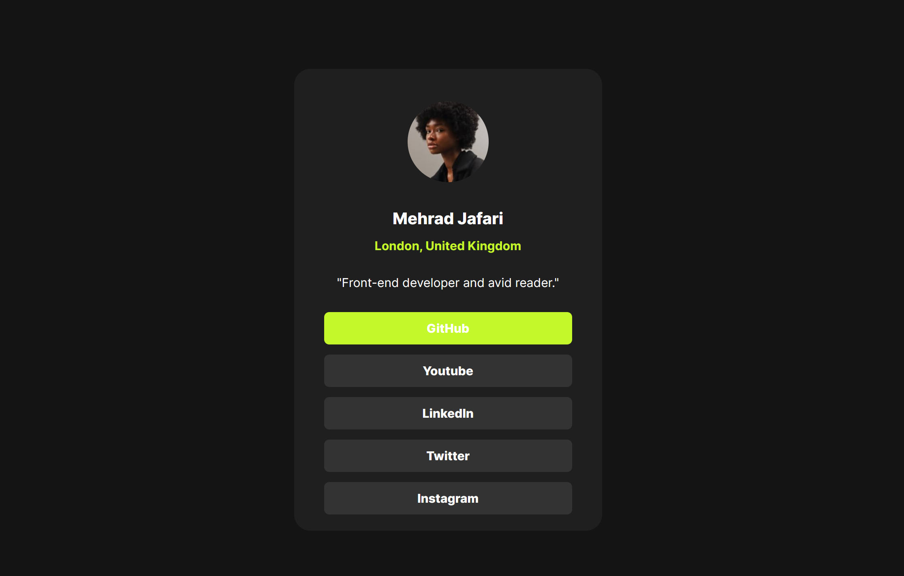

# Social Links Profile

This is a **Social Links Profile** project built with **HTML & CSS**. It provides a simple and clean profile card displaying an avatar, name, location, bio, and social media links.

## 📌 Features
- **Responsive Design** for mobile and desktop users
- **Minimalist UI** with easy-to-read typography
- **Structured HTML & CSS** for clean and maintainable code
- **Custom Styling** using external CSS

## 🛠 Technologies Used
- **HTML5** for structure
- **CSS3** for styling
- **Google Fonts** (if applicable)

## 📁 Project Structure
```
├── assets/
│   ├── images/
│   │   ├── avatar-jessica.jpeg   # Profile image
│   │   ├── favicon-32x32.png     # Favicon
│   ├── style.css                 # Stylesheet
├── index.html                     # Main HTML file
```

## 🚀 How to Use
1. Clone the repository:
   ```sh
   git clone https://github.com/mehradj/social-links-profile.git
   ```
2. Open `index.html` in a web browser.

## 📷 Preview
This is how the Social Links Profile looks:



## 🌐 Live Demo
Check out the live version here: [Social Links Profile](https://mehradj.github.io/social-links-profile/)

## 📝 Author
- **Mehrad Jafari**

## 📜 License
This project is intended for educational and practice purposes and is free to use.

